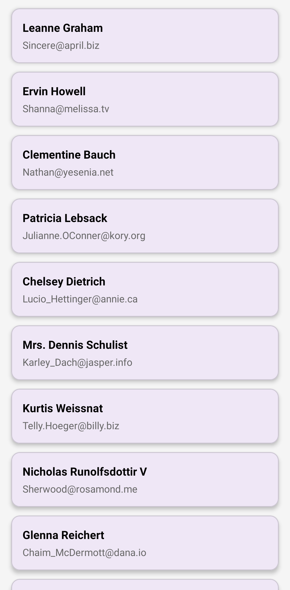
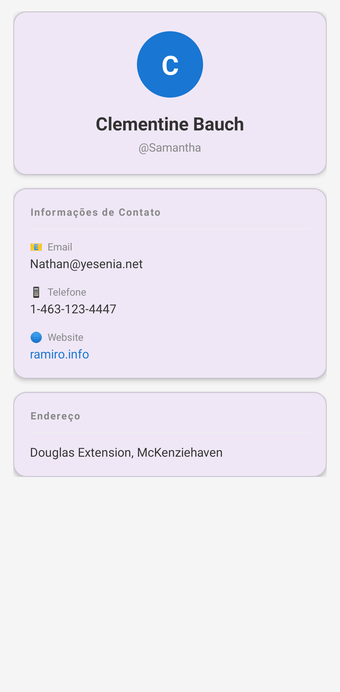

# 📱 Users List App

> Aplicativo Android moderno que consome uma API REST pública e exibe uma lista de usuários com detalhes, desenvolvido com boas práticas de arquitetura e código limpo.

---

## 📸 Screenshots

| Lista de Usuários | Detalhes do Usuário |
|:-----------------:|:-------------------:|
|  |  |

---

## 🚀 Tecnologias Utilizadas

| Tecnologia | Versão | Finalidade |
|---|---|---|
| **Kotlin** | 1.9+ | Linguagem principal |
| **Android SDK** | min 24 / target 34 | Plataforma |
| **MVVM** | - | Arquitetura |
| **Retrofit** | 2.9.0 | Consumo de API REST |
| **Gson** | 2.10.1 | Serialização/desserialização JSON |
| **Coroutines** | 1.7+ | Operações assíncronas |
| **LiveData / StateFlow** | - | Observação de estado reativo |
| **ViewModel** | 2.7+ | Gerenciamento de estado da UI |
| **ViewBinding** | - | Referências de views com segurança de tipo |
| **RecyclerView** | - | Listagem eficiente de dados |
| **MockK** | 1.13+ | Mocks para testes unitários |

---

## 🏗️ Arquitetura

Este projeto segue o padrão **MVVM (Model-View-ViewModel)** com separação clara de responsabilidades:

```
app/
├── ui/                     # Activities, Fragments, Adapters
│   ├── MainActivity.kt
│   ├── DetailActivity.kt
│   └── UserAdapter.kt
├── viewmodel/              # ViewModels com LiveData/StateFlow
│   └── UserViewModel.kt
├── repository/             # Fonte de dados abstrata
│   └── UserRepository.kt
├── network/                # Configuração do Retrofit
│   ├── ApiService.kt
│   └── RetrofitInstance.kt
├── model/                  # Data classes (POJOs)
│   └── User.kt
└── utils/                  # Utilitários e Analytics
    └── AnalyticsTracker.kt
```

### Fluxo de dados

```
View (Activity/Fragment)
    ↕  observa estados
ViewModel
    ↕  chama funções
Repository
    ↕  faz requisição
API (Retrofit)
```

---

## ✨ Funcionalidades

- 📋 Listagem de usuários via API pública
- 👤 Tela de detalhes com nome, e-mail, telefone e website
- ⏳ Estado de loading durante carregamento
- ❌ Tratamento de erros com mensagem amigável
- 🔄 Swipe to refresh para recarregar a lista
- 📊 Rastreamento de eventos de analytics
- 🧪 Testes unitários do ViewModel

---

## 🌐 API Utilizada

**[JSONPlaceholder](https://jsonplaceholder.typicode.com/)** — API pública gratuita para testes e prototipagem.

**Endpoint:** `GET https://jsonplaceholder.typicode.com/users`

Exemplo de resposta:
```json
[
  {
    "id": 1,
    "name": "Leanne Graham",
    "email": "Sincere@april.biz",
    "phone": "1-770-736-0988 x56442",
    "website": "hildegard.org"
  }
]
```

---

## ⚙️ Como Rodar o Projeto

### Pré-requisitos

- Android Studio **Hedgehog** (2023.1.1) ou superior
- JDK 17+
- Android SDK 24+
- Conexão com a internet (para consumir a API)

### Passo a passo

```bash
# 1. Clone o repositório
git clone https://github.com/Felipe-Serri/users-list-app.git

# 2. Abra o projeto no Android Studio
# File → Open → selecione a pasta do projeto

# 3. Aguarde o Gradle sincronizar as dependências

# 4. Rode o app
# Clique em ▶️ Run 'app' ou use Shift + F10
```

> O app pode ser executado em um emulador (AVD) ou em um dispositivo físico com **Modo de Desenvolvedor** ativo.

---

## 🧪 Testes

Para rodar os testes unitários:

```bash
# Via terminal
./gradlew test

# Ou no Android Studio
# Clique com o botão direito em /test → Run Tests
```

Testes cobrem:
- ✅ Estado de sucesso ao carregar usuários
- ✅ Estado de erro ao falhar na requisição

---

## 📊 Analytics

O app rastreia os seguintes eventos:

| Evento | Quando é disparado |
|---|---|
| `screen_list_opened` | Ao abrir a tela de lista |
| `user_clicked` | Ao tocar em um usuário |
| `screen_details_opened` | Ao abrir os detalhes |

> Os logs são exibidos no **Logcat** com a tag `AnalyticsTracker`.

---

## 🔮 Melhorias Futuras

- Cache local com Room Database
- Suporte offline com detecção de rede
- Paginação com Paging 3
- Injeção de dependência com Hilt
- Migração para Jetpack Compose
- CI/CD com GitHub Actions

---

## 📁 Estrutura de Commits

Este projeto segue o padrão **[Conventional Commits](https://www.conventionalcommits.org/)**:

```
feat: adiciona tela de detalhes do usuário
fix: corrige crash ao carregar lista vazia
refactor: separa responsabilidades no Repository
test: adiciona testes unitários do ViewModel
docs: atualiza README com instruções de execução
```

---


## 👨‍💻 Autor

Felipe Serri 

[](https://linkedin.com/in/felipe-serri)
[](https://github.com/Felipe-Serri/users-list-app.git)

---

